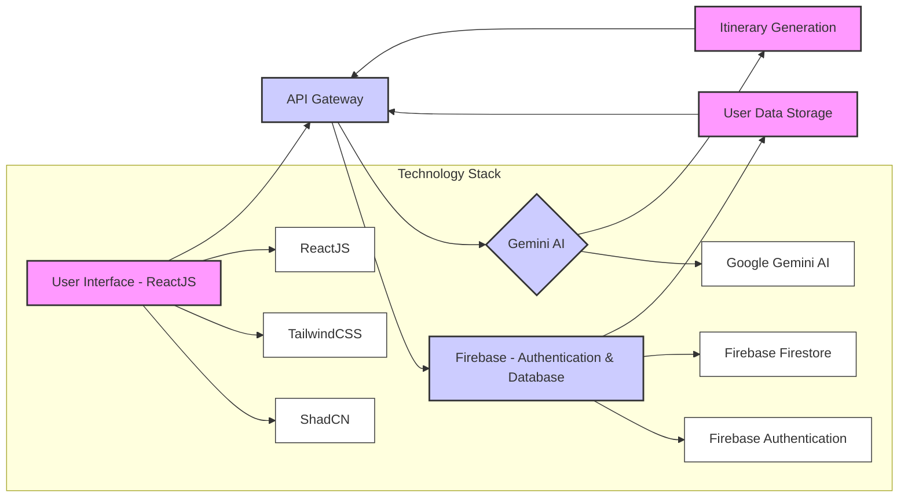

# ✈️ AI Trip Planner - Discover Your Perfect Getaway 🗺️

## Project Overview & Architecture

AI Trip Planner is a web application designed to help users easily plan personalized travel itineraries. Utilizing the power of Gemini AI, Firebase, ReactJS, TailwindCSS, and ShadCN, it offers an intuitive and seamless trip planning experience. The application allows users to input their desired destination, travel dates, budget, and preferences. The AI then generates a suggested itinerary including places to visit, hotels, and other relevant details.

**Why this project?**

Planning a trip can be overwhelming, requiring extensive research and coordination. AI Trip Planner aims to simplify this process by automating itinerary generation, saving users valuable time and effort. It provides a convenient, centralized platform for discovering and organizing travel plans, catering to different budgets and preferences.

**Who is it for?**

This application is intended for anyone who enjoys traveling but struggles with the planning process. Whether you're a solo traveler, a couple, or a family, AI Trip Planner can assist in creating customized itineraries that meet your specific needs and interests.

**Key Features:**

*   ✨ **AI-Powered Itinerary Generation:** Generates trip itineraries based on user input using Gemini AI.
*   📍 **Destination Input:** Allows users to specify their desired travel destination.
*   📅 **Date and Duration Selection:** Users can select travel dates and the duration of their trip.
*   💰 **Budget Customization:** Accommodates different budget ranges, from budget-friendly to luxury travel.
*   🧑‍🤝‍🧑 **Traveler Count:** Optimizes itineraries for solo travelers, couples, families, and groups.
*   🏨 **Hotel Recommendations:** Suggests suitable hotels based on budget and location.
*   🏞️ **Points of Interest:** Highlights popular attractions and activities at the destination.
*   🔥 **Firebase Integration:** Uses Firebase for user authentication and data storage.
*   🎨 **Responsive Design:** Provides a seamless experience on desktops, tablets, and mobile devices.
*   🔒 **User Authentication:** Google Login Integration

**Architecture Diagram:**



**Technology Stack:**

*   ReactJS: 18.3.1
*   Vite: 5.3.4
*   TailwindCSS: 3.4.6
*   ShadCN: (Uses TailwindCSS utilities, version implied by Tailwind version)
*   Firebase: 10.12.4
*   Gemini AI: 0.16.0
*   Node.js: (Implied requirement for Vite, version depends on your environment)

## Getting Started

Follow these steps to set up and run the AI Trip Planner locally.

### Prerequisites

*   Node.js (v18 or higher recommended)
*   npm or yarn package manager
*   Firebase project with Firestore and Authentication enabled
*   Google Cloud project with Gemini AI API enabled
*   Vite (Globally installed) - `npm install -g vite`

### Installation

1.  **Clone the repository:**

    ```bash
    git clone <repository_url>
    cd ai-trip-planner
    ```

2.  **Install dependencies:**

    ```bash
    npm install  # or yarn install
    ```

### Configuration

1.  **Firebase Configuration:**

    *   Go to your Firebase project console.
    *   Create a web app in your Firebase project.
    *   Copy the Firebase configuration object.
    *   Create a `.env` file in the project root directory.
    *   Add the following environment variables to the `.env` file:

        ```
        VITE_FIREBASE_API_KEY=<your_firebase_api_key>
        VITE_FIREBASE_AUTH_DOMAIN=<your_firebase_auth_domain>
        VITE_FIREBASE_PROJECT_ID=<your_firebase_project_id>
        VITE_FIREBASE_STORAGE_BUCKET=<your_firebase_storage_bucket>
        VITE_FIREBASE_MESSAGING_SENDER_ID=<your_firebase_messaging_sender_id>
        VITE_FIREBASE_APP_ID=<your_firebase_app_id>
        VITE_FIREBASE_MEASUREMENT_ID=<your_firebase_measurement_id>
        VITE_GOOGLE_AUTH_CLIENT_ID=<your_google_auth_client_id>

        ```
        Replace the placeholder values with your actual Firebase configuration values and Google Auth Client ID.

2. **Gemini AI API Key:**
    * Create a Google Cloud project and enable the Gemini AI API.
    * Obtain an API key for the Gemini AI API.
    * Add the API key to your `.env` file:
    ```
    VITE_GEMINI_API_KEY=<your_gemini_api_key>
    ```

### Quick Start

1.  **Start the development server:**

    ```bash
    npm run dev  # or yarn dev
    ```

2.  **Open the application in your browser:**

    Navigate to `http://localhost:5173` (or the port specified by Vite) to access the AI Trip Planner.

### Usage Examples

**Creating a Trip:**

1.  Navigate to the "Create Trip" page.
2.  Enter your desired destination, travel dates, budget, and number of travelers.
3.  Click the "Generate Trip" button.
4.  The AI will generate a personalized itinerary for you.

```javascript
// Example usage in CreateTrip component (src/create-trip/index.jsx)
import { AI_PROMPT } from '../constants/options'

const onGenerateTrip = async() => {

  if(formData?.noOfDays>5 && !formData?.location || !formData?.budget || !formData?.noOfPeoples){
    toast("Please fill all the details")
    return ;
  }
  setLoading(true)
  const FINAL_PROMPT = AI_PROMPT
  .replace('{location}',formData?.location)
  .replace('{noOfDays}',formData?.noOfDays)
  .replace('{noOfPeoples}',formData?.noOfPeoples)
  .replace('{budget}',formData?.budget)
  .replace('{noOfDays}',formData?.noOfDays)

  console.log(FINAL_PROMPT)

  const response = await chatSession(FINAL_PROMPT);
  console.log(response)
  const tripId = new Date().getTime()
  await setDoc(doc(db, "AITrips",String(tripId)), {
    ...formData,
    tripDetails:response,
    tripId:tripId
  });

  navigate(`/view-trip/${tripId}`)
  setLoading(false)
}
```

**Viewing a Trip:**

1.  Navigate to the "My Trips" page to see a list of previously created trips or use the route `/view-trip/:tripId`.
2.  Click on a trip to view its details, including the itinerary, hotel recommendations, and points of interest.

```javascript
// Example usage in ViewTrip component (src/view-trip/[tripId]/index.jsx)
import { useParams } from 'react-router-dom'

function ViewTrip() {

    const {tripId} = useParams()
    const [trip, setTrip] = useState([])

    useEffect(() => {
      tripId&&GetTripData();
    }, [tripId])
```

## Detailed Usage Guide

### Core Functionality

The core functionality revolves around generating travel itineraries using the Gemini AI. The `CreateTrip` component gathers user input, constructs an AI prompt, and sends it to the Gemini AI API via the `chatSession` method. The generated itinerary is then stored in Firebase Firestore and can be accessed and viewed via the `ViewTrip` component.

### Configuration Options

*   `VITE_FIREBASE_*`: These environment variables are essential for configuring the connection to your Firebase project.
*   `VITE_GEMINI_API_KEY`: This is required to authenticate requests to the Gemini AI API.

### Troubleshooting

*   **Application not running:** Ensure Node.js and npm (or yarn) are installed correctly. Double-check that all dependencies have been installed using `npm install` or `yarn install`.
*   **Firebase connection errors:** Verify that the Firebase configuration in your `.env` file is accurate. Ensure Firebase Authentication and Firestore are enabled in your Firebase project.
*   **Gemini AI API errors:** Confirm that the `VITE_GEMINI_API_KEY` environment variable is correctly set and that the Gemini AI API is enabled in your Google Cloud project. Also check that your API key has the necessary permissions to access the API.
*   **AI not generating appropriate responses:** Review the AI prompt logic in the `CreateTrip` component. Ensure that the prompt is correctly formatted and includes all necessary information. The quality of the AI's output depends on the prompt design.
*   **Failed to load resource:** Ensure that the Vite development server is properly running.

## Development & Contribution

We welcome contributions to the AI Trip Planner project! Here's how you can get involved.

### Development Setup

1.  **Fork the repository:** Create a fork of the AI Trip Planner repository on GitHub.
2.  **Clone your fork:** Clone your forked repository to your local machine.
3.  **Create a development branch:** Create a new branch for your feature or bug fix.

    ```bash
    git checkout -b feature/your-feature-name
    ```

4.  **Make your changes:** Implement your feature or bug fix, following the code style guidelines.
5.  **Test your changes:** Thoroughly test your changes to ensure they work as expected.

### Testing

This project uses standard React testing practices. To run tests (if any are implemented), use:

```bash
npm test
```

Write new tests for any new functionality you add.

### Code Style

We follow the Airbnb JavaScript style guide. Ensure your code adheres to these guidelines by running ESLint:

```bash
npm run lint
```

### Git Workflow

1.  Commit your changes with clear and concise commit messages.
2.  Push your branch to your forked repository.

    ```bash
    git push origin feature/your-feature-name
    ```

### Pull Request Process

1.  Create a pull request from your branch to the `main` branch of the AI Trip Planner repository.
2.  Provide a clear and detailed description of your changes in the pull request.
3.  Wait for code review. Address any feedback or requested changes.
4.  Once your pull request is approved, it will be merged into the `main` branch.

### Issue Reporting

If you encounter any bugs or issues, please report them by creating a new issue on the GitHub repository. Include a clear description of the issue, steps to reproduce it, and any relevant error messages or screenshots.

### Code of Conduct

Please adhere to the project's Code of Conduct. We are committed to providing a welcoming and inclusive environment for all contributors.
